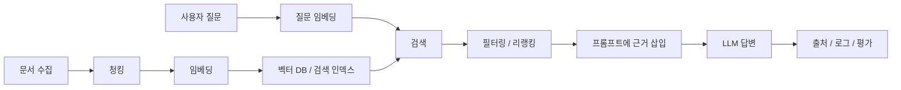
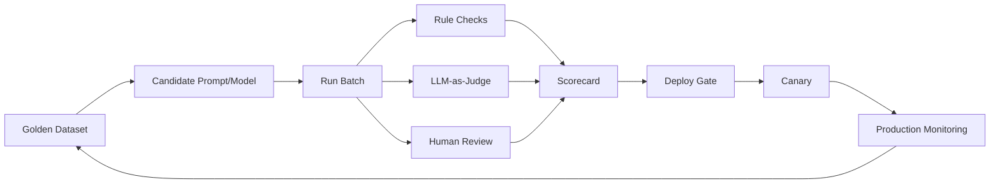

# AX 웹 풀스택 엔지니어 강사 면접 시연 교안

면접: 2026년 4월 22일 수요일 16:40, 팀스파르타 오피스  
시연: 20분 강의 + 질의응답  
대상: 대학교 IT 계열 전공자  
주제: AI 리터러시 & 프롬프트 엔지니어링 / RAG / LLMOps

## 1. 시연 전략

20분 안에 세 파트를 모두 다루되, Part 1은 최신 관점으로 정정하고 Part 2, 3에서 강사 역량을 보여준다.

핵심 메시지:

> Fullstack AX Agent Engineer는 "모델에게 잘 물어보는 사람"이 아니라, 모델을 애플리케이션 안에 넣고 근거, 평가, 배포까지 책임지는 엔지니어다.

발표 흐름:

1. Prompting: 모델에게 업무 계약을 명확히 준다.
2. RAG: 외부 지식과 근거를 연결한다.
3. LLMOps: 품질, 비용, 안전성을 계속 측정하며 운영한다.

권장 시간 배분:

| 구간 | 시간 | 목표 |
| --- | ---: | --- |
| 오프닝 | 1분 | AX 엔지니어 관점 제시 |
| Part 1 | 5분 | LLM 한계, 프롬프팅 정정, 구조화 출력 |
| Part 2 | 7분 | RAG 필요성, 파이프라인, 검색 품질 |
| Part 3 | 6분 | 지표, 버전 관리, Evals, 카나리/롤백 |
| 마무리 | 1분 | 세 축 요약 |

## 2. Part 1 정정 포인트

기존 초안의 좋은 점은 LLM의 한계와 프롬프팅 패턴을 빠르게 소개한다는 점이다. 다만 면접 시연에서는 아래처럼 바로잡아 말하면 좋다.

### 정정 1. Zero-shot -> Few-shot -> CoT가 항상 "상위 단계"는 아니다

기존 표현:

> Zero-shot -> Few-shot -> CoT 순으로 복잡한 태스크에 단계적으로 적용

권장 표현:

> 먼저 간단하고 직접적인 지시로 시작한다. 출력 형식이나 도메인 기준이 흔들릴 때 few-shot을 쓰고, 다단계 판단이 필요할 때는 장황한 사고 과정 요구보다 성공 기준, 제약, 검증 절차를 명확히 준다.

수업에서 말할 문장:

> 프롬프팅은 기술 이름을 많이 쓰는 경쟁이 아닙니다. 좋은 프롬프트는 모델에게 "무엇을, 어떤 기준으로, 어떤 형태로 반환할지"를 계약처럼 알려주는 것입니다.

### 정정 2. Few-shot은 만능 정확도 향상 기법이 아니다

Few-shot이 적합한 경우:

- 출력 형식이 중요할 때: 분류 라벨, JSON 필드, 요약 톤
- 도메인 기준이 암묵적일 때: "좋은 코드 리뷰" 기준, 고객문의 분류 기준
- 모델이 지시만으로 일관된 패턴을 잡지 못할 때

주의점:

- 예시와 지시가 충돌하면 성능이 떨어진다.
- 예시가 너무 많으면 비용이 늘고, 특정 패턴에 과하게 묶일 수 있다.
- 프로덕션에서는 few-shot 예시도 버전 관리와 평가 대상이다.

### 정정 3. CoT는 "무조건 사고 과정을 출력하라"가 아니다

최신 reasoning model은 내부적으로 추론을 수행하므로 "think step by step" 같은 문장을 습관적으로 붙이는 것이 항상 도움이 되지 않는다. 교육 현장에서는 CoT를 "모델의 숨은 사고 과정을 공개하라"가 아니라, 다음처럼 설명하는 편이 안전하다.

권장 표현:

- 사용자에게 필요한 것은 장황한 내부 사고가 아니라 검증 가능한 결론, 근거, 요약된 판단 기준이다.
- 수학 튜터나 교육 앱처럼 풀이를 보여줘야 하는 경우에는 "풀이 단계"를 구조화해서 요구한다.
- 서비스형 AI에서는 "근거 문서, 최종 답변, 불확실성"을 분리해 반환하게 한다.

나쁜 예:

```text
천천히 생각하고 모든 추론 과정을 자세히 공개해줘.
```

좋은 예:

```text
문제를 신중히 해결하되, 답변에는 다음만 포함해줘.
1. 최종 결론
2. 결론을 뒷받침하는 핵심 근거 2개
3. 확인이 더 필요한 불확실한 부분
```

### 정정 4. 구조화 출력은 "JSON처럼 써줘"가 아니라 스키마 계약이다

프로덕션에서는 자연어 답변보다 파싱 가능한 출력 계약이 중요하다.

```ts
const AnswerSchema = z.object({
  answer: z.string(),
  citations: z.array(z.object({
    docId: z.string(),
    quote: z.string()
  })),
  confidence: z.enum(["high", "medium", "low"]),
  needsHumanReview: z.boolean()
});
```

수업에서 말할 문장:

> JSON을 예쁘게 출력하는 것과 스키마를 지키는 것은 다릅니다. 웹 풀스택 관점에서는 LLM의 출력도 API 응답처럼 타입, 실패 케이스, 재시도 전략을 가져야 합니다.

## 3. Part 2 교안: RAG

### 학습 목표

- RAG가 필요한 이유를 설명할 수 있다.
- 기본 RAG 파이프라인을 그림으로 설명할 수 있다.
- 검색 품질을 높이는 핵심 요소를 말할 수 있다.

### 핵심 메시지

> 프롬프트는 모델의 행동을 바꾸지만, RAG는 모델이 참고할 근거를 바꾼다.

### 2-1. RAG가 필요한 이유

LLM만으로 답변할 때 생기는 문제:

- 최신 정보: 모델 학습 이후의 정보는 알 수 없다.
- 사내/학교/서비스 내부 정보: 학습 데이터에 없는 문서는 알 수 없다.
- 근거 요구: "왜 그렇게 답했는지"를 문서 기준으로 확인해야 한다.

RAG가 해결하는 것:

- 검색으로 관련 문서를 찾는다.
- 찾은 문서를 프롬프트 컨텍스트에 넣는다.
- 모델은 해당 근거 안에서 답한다.
- 답변과 함께 출처를 남긴다.

강의 멘트:

> 학생 여러분이 대학 학사 챗봇을 만든다고 해봅시다. "휴학 중 계절학기 신청 가능해요?"라는 질문에 모델이 일반 상식으로 답하면 위험합니다. 학교 규정 PDF, 공지사항, 학사일정에서 근거를 찾아 답해야 하죠. 이때 필요한 구조가 RAG입니다.

### 2-2. 기본 파이프라인



단계별 설명:

| 단계 | 설명 | 강의 포인트 |
| --- | --- | --- |
| 수집 | PDF, Notion, DB, HTML 등 문서 확보 | 최신성, 권한, 중복 제거 |
| 청킹 | 긴 문서를 검색 가능한 조각으로 나눔 | 너무 작으면 맥락 손실, 너무 크면 검색 잡음 |
| 임베딩 | 텍스트를 의미 벡터로 변환 | 의미 기반 검색의 기반 |
| 검색 | 질문과 가까운 문서 조각을 찾음 | top-k, hybrid search, metadata filter |
| 리랭킹 | 후보 문서를 다시 정렬 | 정확도 향상에 효과적 |
| 생성 | 검색 결과를 컨텍스트로 넣어 답변 | 근거 밖 추측 금지 |
| 로깅/평가 | 질문, 검색 문서, 답변, 피드백 저장 | LLMOps와 연결 |

### 2-3. 검색 품질을 높이는 요소

1. Chunking

문서를 무작정 1,000자씩 자르는 것이 아니라 제목, 섹션, 표, 코드 블록 같은 구조를 고려한다.

2. Metadata

문서에 `semester`, `department`, `effectiveDate`, `docType`, `permission` 같은 필드를 붙이면 검색 정확도와 권한 제어가 좋아진다.

3. Hybrid Search

벡터 검색은 의미가 비슷한 문서를 잘 찾고, 키워드 검색은 고유명사, 약어, 코드, 정책 번호에 강하다. 실무에서는 둘을 함께 쓰는 경우가 많다.

4. Reranking

처음에는 후보를 넓게 가져오고, 리랭커로 질문에 정말 맞는 문서를 상위에 올린다.

5. Answer Policy

검색된 근거가 부족하면 답을 지어내지 않고 "현재 제공된 문서에서는 확인할 수 없다"고 답하게 한다.

### 2-4. 짧은 시연 예시

상황:

> 학사 규정 Q&A 챗봇을 만든다.

질문:

```text
휴학 중인 학생도 여름 계절학기를 신청할 수 있나요?
```

검색 결과 예시:

```text
[doc-17] 계절학기 수강 신청 안내
재학생 및 휴학생 중 복학 예정자는 계절학기 수강 신청이 가능하다.

[doc-22] 휴학/복학 규정
휴학생은 정규학기 수강 신청 대상이 아니며, 복학 예정 학기 등록 절차를 따라야 한다.
```

RAG 프롬프트 예시:

```text
당신은 대학교 학사 규정 Q&A 어시스턴트입니다.
아래 <context>의 근거만 사용해 답변하세요.
근거가 부족하면 확인 불가라고 말하세요.
답변 끝에 사용한 docId를 표시하세요.

<context>
...
</context>
```

답변 예시:

```text
가능할 수 있습니다. 제공된 계절학기 안내에 따르면 "휴학생 중 복학 예정자"는 계절학기 수강 신청이 가능합니다. 다만 단순 휴학생 전체가 아니라 복학 예정 여부가 조건이므로, 본인의 복학 예정 학기와 신청 자격을 학사팀에서 확인해야 합니다. [doc-17]
```

### 2-5. 오개념 정리

| 오개념 | 바로잡기 |
| --- | --- |
| 벡터 DB만 붙이면 RAG다 | 검색, 필터링, 프롬프트, 출처, 평가까지 포함해야 한다 |
| 문서를 많이 넣을수록 좋다 | 관련 없는 문서는 모델을 헷갈리게 한다 |
| RAG를 쓰면 환각이 사라진다 | 환각을 줄이는 구조이지 제거하는 마법은 아니다 |
| 파인튜닝과 RAG는 경쟁 관계다 | 지식 업데이트는 RAG, 말투/행동 패턴은 파인튜닝이 더 적합한 경우가 많다 |

### 학생 확인 질문

- "우리 서비스 FAQ가 매일 바뀐다면 프롬프트 수정, 파인튜닝, RAG 중 무엇이 적합할까요?"
- "검색 결과가 틀리면 LLM 답변은 좋아질 수 있을까요?"
- "벡터 검색만 쓰면 고유명사 검색에서 어떤 문제가 생길까요?"

## 4. Part 3 교안: LLMOps

### 학습 목표

- LLM 서비스 운영 시 추적할 핵심 지표를 설명할 수 있다.
- 프롬프트 버전 관리와 안전한 배포 전략을 이해할 수 있다.
- 자동 평가 파이프라인의 구조를 설명할 수 있다.

### 핵심 메시지

> LLM 서비스의 출시일은 끝이 아니라 관측, 평가, 개선 루프의 시작이다.

### 3-1. 왜 LLMOps가 필요한가

일반 웹 서비스와 다른 점:

- 같은 질문에도 모델 응답이 달라질 수 있다.
- 프롬프트 한 줄 변경이 품질, 비용, 안전성에 영향을 준다.
- 모델 버전, 검색 인덱스, 문서 데이터가 계속 바뀐다.
- 정답이 하나로 고정되지 않는 태스크가 많다.

강의 멘트:

> 일반 API는 status code와 latency만 봐도 꽤 많은 걸 알 수 있습니다. 그런데 LLM API는 200 OK가 떠도 답변이 틀릴 수 있습니다. 그래서 LLMOps에서는 '응답이 왔는가'보다 '쓸 수 있는 답변인가'를 측정해야 합니다.

### 3-2. 추적해야 할 핵심 지표

| 범주 | 지표 | 설명 |
| --- | --- | --- |
| 품질 | 정답률, 도움됨, 관련성 | 사용자의 목적을 해결했는가 |
| 근거성 | faithfulness, citation accuracy | 검색 문서에 근거해 답했는가 |
| 검색 | hit@k, recall@k, MRR | 정답 문서가 검색 결과 상위에 있는가 |
| 안전 | PII 노출, 정책 위반, prompt injection 성공률 | 위험한 출력이나 데이터 유출이 없는가 |
| 비용 | input/output tokens, 요청당 비용 | 운영 가능한 비용인가 |
| 성능 | p50/p95 latency, timeout rate | 사용자가 기다릴 수 있는가 |
| 제품 | thumbs up/down, 재질문율, 이탈률 | 실제 사용자 경험이 좋아졌는가 |

### 3-3. 로깅 설계

LLM 요청 로그에 들어가야 하는 정보:

```json
{
  "requestId": "req_20260422_001",
  "userIntent": "academic_policy_qa",
  "model": "model-name",
  "promptVersion": "prompt-rag-qa-v3",
  "schemaVersion": "answer-schema-v2",
  "retrievalIndexVersion": "academic-docs-2026-04-20",
  "retrievedDocIds": ["doc-17", "doc-22"],
  "latencyMs": 1840,
  "inputTokens": 1220,
  "outputTokens": 210,
  "safetyFlags": [],
  "userFeedback": "up"
}
```

주의:

- 개인정보와 민감정보는 마스킹하거나 저장하지 않는다.
- 전체 프롬프트 저장이 필요한 경우 접근 권한과 보관 기간을 제한한다.
- 로그는 디버깅뿐 아니라 평가 데이터 생성의 출발점이다.

### 3-4. 프롬프트 버전 관리

프롬프트도 코드처럼 관리한다.

```text
prompt-rag-qa-v1
  - 근거 기반 답변 지시

prompt-rag-qa-v2
  - 근거 부족 시 "확인 불가" 정책 추가

prompt-rag-qa-v3
  - citation 필드 JSON schema 추가
```

버전으로 묶어야 할 것:

- model version
- system/developer prompt
- few-shot examples
- JSON schema
- retrieval index
- chunking strategy
- safety policy

### 3-5. 안전한 배포: Canary와 Rollback

배포 흐름:

1. 오프라인 eval 통과
2. 내부 사용자 100% 적용
3. 실제 트래픽 5% canary
4. 품질/비용/안전 지표 비교
5. 25% -> 50% -> 100% 확대
6. 지표 악화 시 즉시 이전 버전으로 rollback

강의 멘트:

> 프롬프트 변경은 코드 변경보다 가볍게 느껴지지만, 사용자에게는 제품 동작 변경입니다. 그래서 '금요일 오후에 프롬프트를 바로 전체 배포'하는 건 좋은 운영 습관이 아닙니다.

### 3-6. Evals 파이프라인



평가 데이터 예시:

| input | expected evidence | pass criteria |
| --- | --- | --- |
| 휴학생 계절학기 신청 가능? | doc-17 | 복학 예정 조건 언급, doc-17 인용 |
| 장학금 신청 마감일은? | doc-31 | 날짜 정확, 추가 추측 없음 |
| 문서에 없는 기숙사 규정 질문 | none | 확인 불가 답변 |

평가 방식:

- Rule check: JSON schema, 금지어, citation 존재 여부
- Retrieval eval: 정답 문서가 top-k 안에 있는지
- LLM-as-judge: 도움됨, 근거성, 명확성
- Human review: 법률/의료/금융/학사 규정처럼 리스크가 큰 영역

## 5. 20분 발표 스크립트

### Slide 1. 오프닝

> 안녕하세요. 오늘은 Fullstack AX Agent Engineer가 AI 서비스를 만들 때 꼭 이해해야 할 세 가지 축을 보겠습니다. 프롬프트를 잘 쓰는 법에서 시작하지만, 거기서 끝내지 않겠습니다. 실제 서비스에서는 근거를 붙이고, 배포 후에도 품질과 비용을 계속 관측해야 합니다.

### Slide 2. 전체 지도

> 세 축은 Prompting, RAG, LLMOps입니다. Prompting은 모델에게 일을 시키는 계약, RAG는 외부 지식을 연결하는 근거 파이프라인, LLMOps는 그 서비스를 계속 믿을 수 있게 만드는 운영 루프입니다.

### Slide 3. LLM의 기본 이해

> LLM은 맥락을 보고 다음에 올 가능성이 높은 토큰을 생성합니다. 이 설명은 단순화된 모델이지만 중요한 감각을 줍니다. LLM은 데이터베이스도, 계산기도, 진실 판정기도 아닙니다. 그래서 환각, 지식 컷오프, 편향 같은 한계가 생깁니다.

### Slide 4. 프롬프팅 정정

> 여기서 흔한 오해가 있습니다. Zero-shot, few-shot, CoT를 난이도 사다리처럼 외우는 것입니다. 실제로는 먼저 간단하고 직접적인 지시를 쓰고, 형식이나 기준이 흔들릴 때 few-shot을 붙입니다. 그리고 최신 reasoning model에서는 'think step by step'을 습관적으로 붙이기보다 목표, 제약, 검증 기준을 명확히 주는 편이 좋습니다.

### Slide 5. 구조화 출력

> 풀스택 개발자 관점에서는 LLM 출력도 API 응답입니다. 사용자가 읽을 자연어만 받으면 후처리가 어렵습니다. 그래서 스키마, 실패 케이스, 재시도, 폴백까지 같이 설계해야 합니다.

### Slide 6. RAG가 필요한 이유

> 프롬프트가 모델의 행동을 바꾼다면, RAG는 모델이 참고할 근거를 바꿉니다. 학교 학사 챗봇을 예로 들면, "휴학 중 계절학기 신청 가능?"이라는 질문에 모델 상식으로 답하면 위험합니다. 실제 규정 문서를 찾아 답해야 합니다.

### Slide 7. RAG 파이프라인

> RAG는 벡터 DB 하나가 아닙니다. 문서를 수집하고, 청킹하고, 임베딩하고, 검색하고, 리랭킹하고, 프롬프트에 넣고, 답변과 출처를 남기는 전체 흐름입니다.

### Slide 8. 검색 품질

> RAG 품질은 모델보다 검색에서 무너지는 경우가 많습니다. 정답 문서를 못 찾으면 아무리 좋은 모델도 좋은 답을 만들기 어렵습니다. 그래서 청킹, 메타데이터, hybrid search, reranking, answer policy가 중요합니다.

### Slide 9. 미니 시연

> 예를 들어 검색 결과에 "휴학생 중 복학 예정자는 계절학기 신청 가능"이라는 문서가 들어왔다면, 답변은 "가능합니다"가 아니라 "복학 예정자라면 가능할 수 있습니다"가 되어야 합니다. 이 차이가 RAG의 핵심입니다. 근거를 읽고 조건을 보존하는 것입니다.

### Slide 10. LLMOps가 필요한 이유

> 이제 서비스를 만들었다고 끝이 아닙니다. LLM 서비스는 200 OK가 떠도 답변이 틀릴 수 있습니다. 그래서 일반 웹 로그에 더해 답변 품질, 근거성, 안전성, 비용을 같이 봐야 합니다.

### Slide 11. 운영 지표

> 운영 지표는 크게 품질, 근거성, 검색, 안전, 비용, 성능, 제품 지표로 나눌 수 있습니다. 특히 RAG 서비스에서는 retrieval hit@k와 citation accuracy가 중요합니다. 모델 답변만 보면 검색이 문제인지 생성이 문제인지 분리할 수 없습니다.

### Slide 12. 버전 관리와 배포

> 프롬프트도 코드처럼 버전 관리해야 합니다. 모델 버전, 프롬프트 버전, 스키마 버전, 검색 인덱스 버전이 함께 남아야 장애가 났을 때 원인을 찾을 수 있습니다. 배포도 canary로 조금씩 열고, 지표가 악화되면 rollback해야 합니다.

### Slide 13. Evals

> 자동 평가는 LLM 서비스의 테스트 코드입니다. 좋은 평가셋에는 정상 질문뿐 아니라 문서에 없는 질문도 들어가야 합니다. 답을 잘하는지뿐 아니라, 모를 때 모른다고 하는지도 평가해야 합니다.

### Slide 14. 마무리

> 오늘의 결론입니다. Prompting은 지시 계약, RAG는 근거 파이프라인, LLMOps는 신뢰성 루프입니다. AX 엔지니어는 이 세 가지를 연결해 사용자가 믿고 쓸 수 있는 AI 서비스를 만드는 사람입니다.

## 6. 예상 Q&A

### Q1. Part 1에서 CoT 설명을 왜 바꾸셨나요?

답변:

> 기존 CoT 설명은 초급자에게 "단계적으로 생각하게 하면 좋아진다"는 직관을 주기에는 좋습니다. 다만 최신 reasoning model에서는 내부 추론 능력이 강화되어 있고, 무조건 사고 과정을 출력하게 하는 방식이 항상 성능을 높이지 않습니다. 그래서 저는 CoT를 '내부 사고 공개'가 아니라 '문제 분해, 검증 기준, 필요한 경우 풀이 단계 구조화'로 가르치는 편이 더 안전하다고 봤습니다.

### Q2. RAG와 파인튜닝의 차이를 어떻게 설명하시겠어요?

답변:

> 지식이 자주 바뀌거나 출처가 중요하면 RAG가 우선입니다. 반대로 말투, 분류 기준, 반복되는 행동 패턴을 모델에 익히고 싶다면 파인튜닝이 적합할 수 있습니다. 실무에서는 둘을 경쟁 관계로 보지 않고, RAG로 지식을 연결하고 파인튜닝이나 프롬프트로 행동을 맞추는 식으로 결합합니다.

### Q3. RAG를 쓰면 환각이 없어지나요?

답변:

> 없어지는 것이 아니라 줄어듭니다. RAG에서도 검색 결과가 틀리거나, 관련 없는 문서가 들어오거나, 모델이 근거 밖으로 추론하면 환각이 생길 수 있습니다. 그래서 검색 평가, citation 검증, 근거 부족 시 답변 거부 정책이 함께 필요합니다.

### Q4. LLMOps에서 가장 먼저 구축할 것은 무엇인가요?

답변:

> 처음부터 거창한 플랫폼을 만들기보다 requestId, promptVersion, model, retrievedDocIds, latency, token usage, user feedback 정도를 남기는 로그부터 시작하겠습니다. 그다음 자주 실패하는 케이스를 골든 데이터셋으로 만들고, 배포 전 eval gate를 붙이는 순서가 현실적입니다.

### Q5. 대학생 대상 강의에서 난이도 조절은 어떻게 하실 건가요?

답변:

> 먼저 일상적인 질문으로 개념을 잡고, 바로 웹 서비스 예시로 연결하겠습니다. 예를 들어 학사 챗봇, 채용 FAQ, 쇼핑몰 CS처럼 학생들이 이해하기 쉬운 도메인을 쓰고, 마지막에는 TypeScript pseudo code와 운영 로그를 보여주면서 풀스택 개발 관점으로 확장하겠습니다.

## 7. 참고한 최신 자료

- OpenAI, Reasoning best practices: reasoning model은 간단하고 직접적인 프롬프트를 권장하며, chain-of-thought를 습관적으로 요구하는 방식은 불필요하거나 방해될 수 있다고 설명한다. https://developers.openai.com/api/docs/guides/reasoning-best-practices
- OpenAI, Prompt engineering: few-shot은 입력/출력 예시로 작업 패턴을 유도하는 방식이며, production에서는 모델 스냅샷 고정과 eval 구축을 권장한다. https://developers.openai.com/api/docs/guides/prompt-engineering
- OpenAI, Structured Outputs: JSON mode보다 schema adherence를 보장하는 structured output을 권장하며, 스키마와 코드 타입의 divergence를 피하라고 안내한다. https://developers.openai.com/api/docs/guides/structured-outputs
- OpenAI, Evals: eval은 task 정의, test input 실행, 결과 분석과 개선의 루프로 구성된다. https://developers.openai.com/api/docs/guides/evals
- OpenAI, Production best practices: production 전환 시 비용, latency, rate limit, MLOps 관점을 고려하라고 안내한다. https://developers.openai.com/api/docs/guides/production-best-practices
